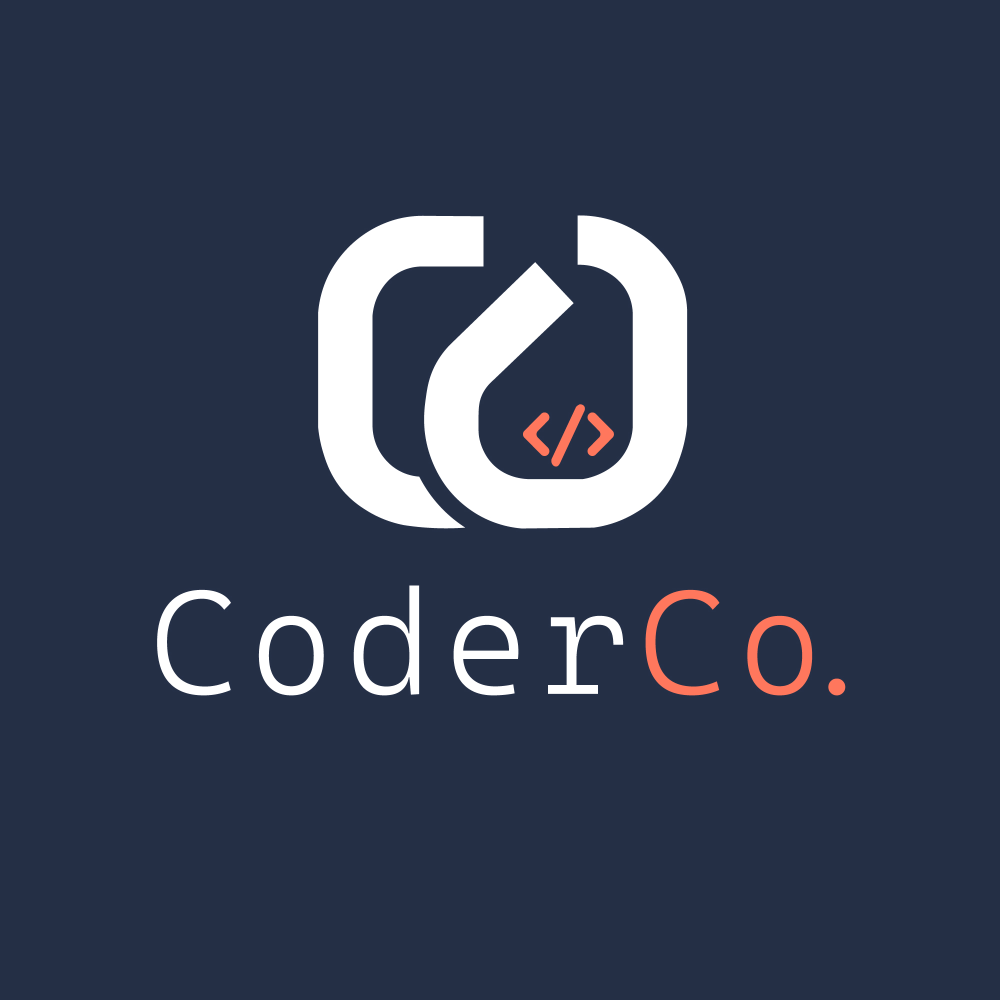

<div align="center">
    
</div>

# Project: CoderCo Assignment 1 - Open Source App Hosted on Azure with Terraform 🚀

## Overview

This project mirrors the AWS ECS-based setup, but we will now deploy the open-source app on Azure using Azure Container Apps. 

The goal is to package, build, and deploy an application using Terraform and CI/CD pipelines, ensuring best practices in infrastructure as code, security, and scalability.

Key Components:
- Azure Container Registry (ACR) for container images.
- Azure Container Apps (or AKS) to run containers.
- Azure Application Gateway or Front Door for HTTPS routing.
- GitHub Actions or Azure DevOps for CI/CD (your choice).

## System Architecture


## Task/Assignment 📝

- Create a repository for your work.
- Containerize the app and push it to Azure Container Registry (ACR).
- Use a CI/CD pipeline (GitHub Actions, Azure DevOps, or another) to build, test, and push the container image.
- Deploy the app on Azure using Terraform:
  - Azure Container Apps
- Expose the application via HTTPS using Azure Application Gateway or Azure Front Door.
- Ensure the app is available at:
  - https://tm.<your-domain>.co.uk or
  - https://tm.labs.<your-domain>.co.uk
- Add screenshots of the live app to the README.md.
- Include an architecture diagram of your infrastructure (Lucidchart, draw.io, or Mermaid).

## Guidance & Hints 📚

### Directory Structure

- `terraform/` - Terraform configuration for Azure resources. Use modules for reusable components.
- `app/` -  App code and Dockerfile.
- `.github/workflows/` - CI/CD pipeline configuration (GitHub Actions). Or any other CI/CD tool you want to use.
- `docs/` - Documentation for the project. Diagrams/Architectures.
- `README.md` - Project documentation.

### Local app 💻

```bash
cd app

### create a virtual environment
python3 -m venv .venv

source .venv/bin/activate
pip3 install -r requirements.txt
### run the app
python3 app.py ## python3 app.py
```

### API

```bash
# Create task
curl -X POST -H "Content-Type: application/json" -d '{"title":"New Task"}' http://localhost:3000/tasks

# List tasks
curl http://localhost:3000/tasks

# Update task
curl -X PUT -H "Content-Type: application/json" -d '{"completed":true}' http://localhost:3000/tasks/1

# Delete task
curl -X DELETE http://localhost:3000/tasks/1
```

## Screenshots

Add screenshots of your deployed application here. For example:

- Home Page
- Task Manager in Action

## Terraform Region Notes

This stack reads the Azure region from the existing resource group by default.

- `azurerm_container_app_environment` is deployed in the resource group's region because it is attached to a subnet in the same virtual network.
- `azurerm_cosmosdb_account` also defaults to the resource group's region, but you can override it if that region is blocked for new Cosmos DB accounts.

If Azure returns `RequestDisallowedByAzure` for an ineligible location:

1. Check the existing resource group's region.
2. If that region is blocked for Container Apps, use or create a resource group in an eligible region and rerun Terraform.
3. If only Cosmos DB is blocked, override `cosmos_location` with an eligible region, for example:

```bash
terraform apply -var="cosmos_location=uksouth"
```

You can inspect the current resource group region with:

```bash
az group show --name 27_state_file --query location --output tsv
```

## Reusing An Existing Container Apps Environment

If Azure already has a Container Apps environment attached to `container-apps-subnet`, Terraform must reuse that environment instead of creating a second one on the same subnet.

Set the existing environment name when applying:

```bash
terraform -chdir=infra apply -var="existing_container_app_environment_name=task-manager-cae"
```

Leave `existing_container_app_environment_name` unset only when Terraform should create a new Container Apps environment itself.
# mhr_azure
