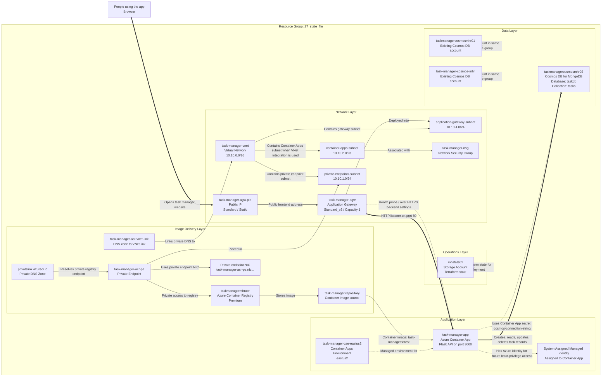

# Azure Architecture: 27_state_file

## Header

- **Resource group:** `27_state_file`
- **Subscription:** `a3ea6416-7936-4e88-8568-4d67676f0cbd`
- **Primary resource group region:** `eastus`
- **Application runtime region:** `eastus2`
- **Purpose:** Task Manager web application hosted on Azure Container Apps with Azure Application Gateway, Azure Container Registry, Azure Cosmos DB, and Azure networking.

## Summary

This Azure environment hosts a task manager web application. People reach the service through Azure Application Gateway, which acts as the public front door. The gateway routes traffic to the Flask application running in Azure Container Apps.

The application image is stored in Azure Container Registry, and the running app stores task data in Azure Cosmos DB using the MongoDB API. The virtual network provides the cloud network layout for the gateway, private endpoints, and Container Apps integration where region placement allows.

The resource group also contains the Terraform state storage account and a few older Cosmos DB accounts. The active app configuration in the Terraform files points at `taskmanagercosmosmhr02`, `task-manager-app`, and `taskmanagermhracr`.

## Resource Inventory

| Resource | Azure type | Region | Role in the design |
|---|---|---:|---|
| `mhstate01` | `Microsoft.Storage/storageAccounts` | `eastus` | Stores Terraform state for infrastructure management. |
| `task-manager-nsg` | `Microsoft.Network/networkSecurityGroups` | `eastus` | Network security group associated with the Container Apps subnet. |
| `task-manager-vnet` | `Microsoft.Network/virtualNetworks` | `eastus` | Virtual network with address space `10.10.0.0/16`. |
| `privatelink.azurecr.io` | `Microsoft.Network/privateDnsZones` | `global` | Private DNS zone for Azure Container Registry private endpoint resolution. |
| `task-manager-cosmos-mhr` | `Microsoft.DocumentDB/databaseAccounts` | `eastus` | Existing Cosmos DB account in the group; not the active Terraform default. |
| `privatelink.azurecr.io/task-manager-acr-vnet-link` | `Microsoft.Network/privateDnsZones/virtualNetworkLinks` | `global` | Links private ACR DNS to the task manager virtual network. |
| `taskmanagermhracr` | `Microsoft.ContainerRegistry/registries` | `eastus` | Premium Azure Container Registry; contains the `task-manager` repository. |
| `task-manager-acr-pe` | `Microsoft.Network/privateEndpoints` | `eastus` | Private endpoint for ACR in the private endpoints subnet. |
| `taskmanagercosmosmhr01` | `Microsoft.DocumentDB/databaseAccounts` | `eastus` | Existing Cosmos DB account in the group; not the active Terraform default. |
| `task-manager-acr-pe.nic.6d8872cc-7459-4ad6-b011-74ca02d29a6d` | `Microsoft.Network/networkInterfaces` | `eastus` | Network interface created for the ACR private endpoint. |
| `task-manager-agw-pip` | `Microsoft.Network/publicIPAddresses` | `eastus` | Static public IP for Azure Application Gateway. |
| `taskmanagercosmosmhr02` | `Microsoft.DocumentDB/databaseAccounts` | `eastus2` | Active Cosmos DB account for the task app; MongoDB API with `taskdb` and `tasks`. |
| `task-manager-cae-eastus2` | `Microsoft.App/managedEnvironments` | `eastus2` | Managed environment for Azure Container Apps. |
| `task-manager-app` | `Microsoft.App/containerApps` | `eastus2` | Active Flask task manager application container. |

## Architecture Diagram

## Relationship Details

- **Visitor path:** A browser reaches the static public IP for Application Gateway. Application Gateway is the managed public entry point and sends healthy requests to `task-manager-app`.
- **Application runtime:** `task-manager-app` runs the Flask service in Azure Container Apps inside the `task-manager-cae-eastus2` managed environment.
- **Image delivery:** `taskmanagermhracr` stores the `task-manager` container repository. The Container App is configured to pull the `task-manager:latest` image from this registry.
- **Data path:** The Flask app stores task records in Cosmos DB for MongoDB. The Terraform configuration names the active database as `taskdb` and collection as `tasks`.
- **Secrets:** The app receives database connectivity through a Container App secret named `cosmos-connection-string`. Secret values are intentionally not shown in this document.
- **Network layout:** The virtual network uses `10.10.0.0/16` and includes separate subnets for Application Gateway, Container Apps, and private endpoints.
- **Private registry access:** A private endpoint, private DNS zone, and DNS virtual network link exist for Azure Container Registry private connectivity.
- **Operations:** `mhstate01` supports infrastructure operations by storing Terraform state.

## Notes And Recommendations

- The visual icon presentation is available in the Cursor canvas `azure-task-manager-system-design.canvas.tsx`.
- The resource group contains older Cosmos DB accounts in addition to the active `taskmanagercosmosmhr02` account. Keep them only if they are still needed.
- Application Gateway currently exposes HTTP on port `80`. For production, add HTTPS listener configuration with a certificate.
- ACR is Premium and has private endpoint support configured. The current Container App registry configuration uses an admin password secret; using managed identity with least privilege is a stronger long-term pattern.
- Cosmos DB public network access is enabled in Terraform. Consider private access and stricter firewall rules for production.
