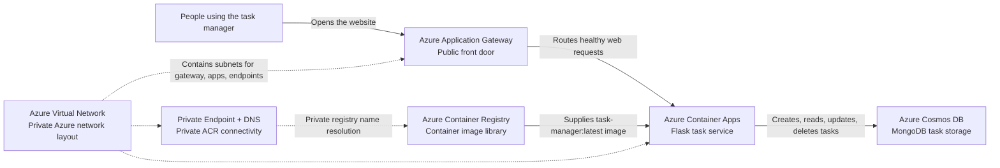

# Azure Task Manager System Design

This document explains the Azure service design for the task manager application in business-friendly language. The matching visual canvas is designed for presentation, with Azure-style service icons and simplified flow labels.

## Executive Summary

The service is a small web application for creating and managing tasks. Azure provides the public entry point, runs the application container, stores the container image, protects the network layout, and keeps task records in a managed database.

At a high level, a user visits the task manager website, Azure Application Gateway receives the request, Azure Container Apps runs the Flask application, and Azure Cosmos DB stores the task data. Azure Container Registry supports the release process by holding the application image that Container Apps runs.

## Main Services

- **Azure Application Gateway** is the public front door. It receives browser traffic and routes healthy requests to the running app.
- **Azure Container Apps** runs the Flask task manager container on port `3000`.
- **Azure Container Registry** stores the `task-manager:latest` container image.
- **Azure Cosmos DB for MongoDB** stores task records in the `taskdb` database and `tasks` collection.
- **Azure Virtual Network** organizes private network areas for Application Gateway, Container Apps, and private endpoints.
- **Private Endpoint and Private DNS for ACR** prepare private registry access inside the virtual network.
- **Managed Identity** gives the running app an Azure identity, so future permissions can be governed without credentials in source code.

## How The Services Work Together

## Presentation Talk Track

Think of the platform like a managed office. The Application Gateway is the reception desk where visitors arrive. Container Apps is the team doing the work, running the task manager application. Cosmos DB is the filing system that remembers each task. Container Registry is the package room where the approved version of the application is kept before it is used.

The virtual network is the building layout. It separates where the front door, application runtime, and private endpoints sit, which makes the design easier to secure and operate as it grows.

## Current Design Notes

- Application Gateway currently exposes HTTP on port `80`, then connects to the Container App backend over HTTPS.
- The Container App uses a secret named `cosmos-connection-string`; the actual secret value is not documented here.
- Cosmos DB has public network access enabled in the current Terraform. For a stronger production posture, this can later move toward private access and identity-based access where supported.
- ACR is Premium with a private endpoint and private DNS zone configured, but admin credentials are currently used by the Container App registry configuration.
