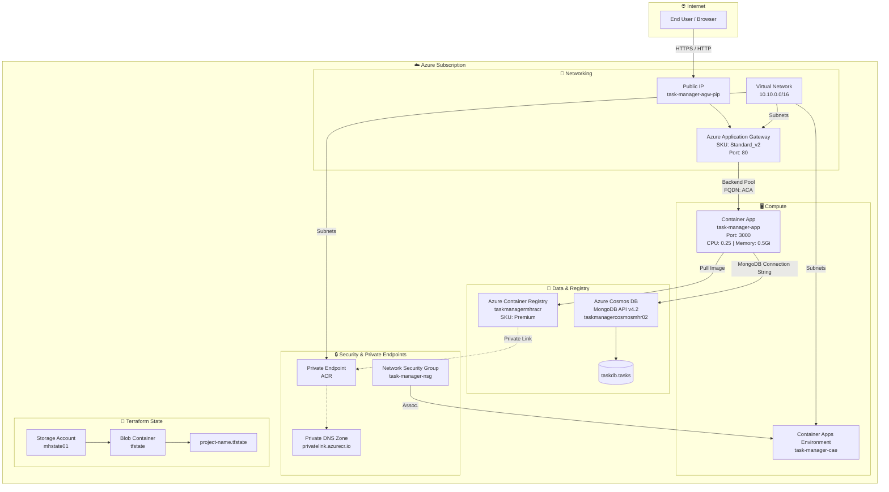
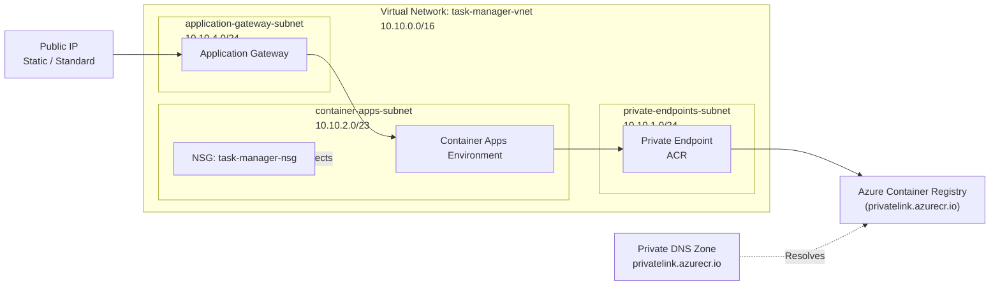
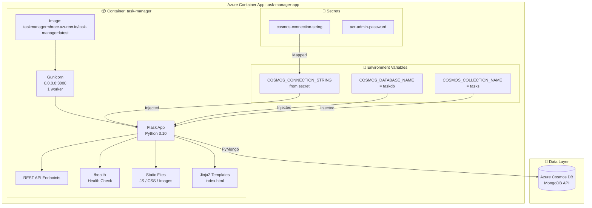
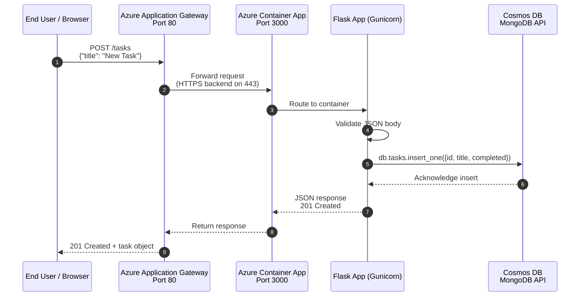
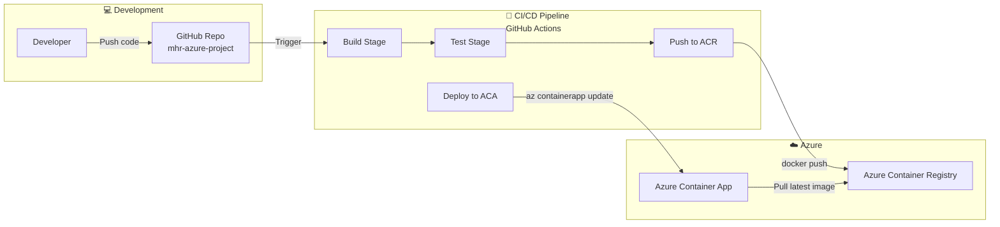

# System Design — MHR Azure Task Manager

> Mermaid diagrams covering the architecture, network topology, and request flow for the Azure-based Task Manager application.

---

## 1. High-Level Architecture

---

## 2. Network Topology

---

## 3. Container App — Internal Design

---

## 4. Request Flow — User Creates a Task

---

## 5. CI/CD Deployment Flow (Reference)

---

## 6. Component Legend

| Component | Azure Service | Purpose |
|-----------|-------------|---------|
| **Application Gateway** | `azurerm_application_gateway` | Public HTTPS entry point, load balancer, health probes |
| **Container App** | `azurerm_container_app` | Hosts the Flask Task Manager API |
| **Container Apps Env** | `azurerm_container_app_environment` | Managed serverless compute environment |
| **Container Registry** | `azurerm_container_registry` | Stores Docker images (Premium SKU) |
| **Cosmos DB** | `azurerm_cosmosdb_account` | MongoDB-compatible database for task storage |
| **Virtual Network** | `azurerm_virtual_network` | Isolated network 10.10.0.0/16 |
| **Private Endpoint** | `azurerm_private_endpoint` | Secure private access to ACR |
| **NSG** | `azurerm_network_security_group` | Network security rules for subnets |
| **Terraform State** | `azurerm` backend | Remote state in Azure Blob Storage |

---

*Generated from Terraform infrastructure and application code analysis.*
